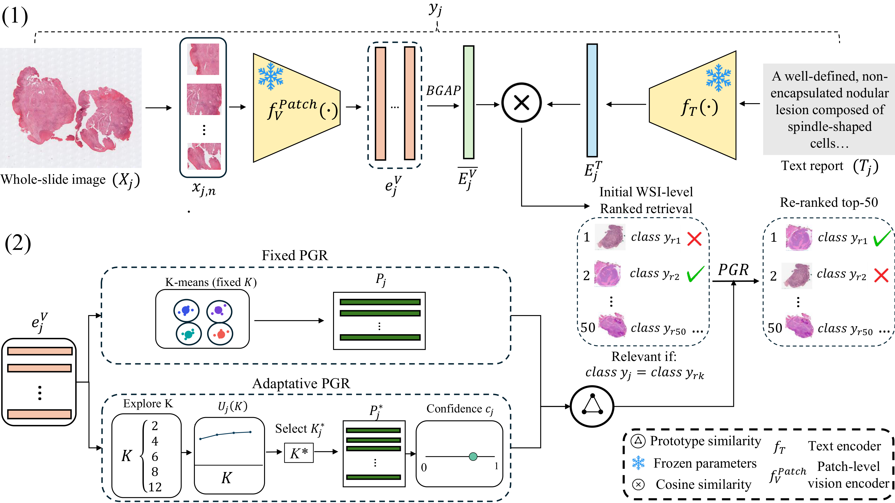

# Prototype-guided Reranking for Cross-modal Histopathology Retrieval

[](https://www.python.org/)
[](LICENSE)
[]()

Post-hoc, training-free reranking method for cross-modal retrieval (image↔text) in computational pathology. Operates on precomputed frozen embeddings — no model retraining, no labels, no GPU required at inference.

> No clinical data, model weights, or restricted embeddings are included in this repository.

---

## Method



Top-50 candidates from global similarity are re-ranked using prototype
similarity (△ in the figure), computed either with a fixed number of
prototypes per case or with a per-case adaptive count K\*. See
[docs/method_overview.md](docs/method_overview.md) for the full formulation.

---

## Requirements

This repository only requires Python 3.9+ and standard scientific libraries
(NumPy, scikit-learn, pandas, matplotlib). See `requirements.txt`.

> **Model environments** — KEEP, CONCH, MUSK, PATHO-CLIP, TITAN and PRISM each
> require their own Python environment and dependencies (some are gated on
> HuggingFace and have specific CUDA/PyTorch requirements). This reranking code
> operates entirely on **precomputed embeddings** and is independent of those
> environments. Refer to each model's documentation before generating embeddings.
> See [docs/external_models.md](docs/external_models.md) for pointers.

## Quickstart

### 1. Install

```bash
pip install -r requirements.txt
```

### 2. Prepare your data

```
data/
  text.npy               # (N, d)   one L2-normalised text embedding per case
  image_meanpool.npy     # (N, d)   mean-pooled patch embedding per case
  patches/
    CASE_0001.npy        # (P_i, d) patch matrix per case  (variable P_i)
  metadata.csv           # two columns: case_id, label
```

All embeddings must be **L2-normalised** and share the same dimension d.

### 3. Run

```bash
# Baseline — global cosine similarity
python scripts/run_baseline.py \
    --text-emb data/text.npy --image-emb data/image_meanpool.npy \
    --meta data/metadata.csv

# Fixed prototype reranking  (K = mean patch count / 50, minimum 2)
python scripts/run_fixed_reranking.py \
    --text-emb data/text.npy --image-emb data/image_meanpool.npy \
    --patch-dir data/patches/ --meta data/metadata.csv --K 8

# Adaptive prototype reranking  (K* selected automatically per slide)
python scripts/run_adaptive_reranking.py \
    --text-emb data/text.npy --image-emb data/image_meanpool.npy \
    --patch-dir data/patches/ --meta data/metadata.csv

# All three methods in one run
python scripts/run_full_evaluation.py \
    --text-emb data/text.npy --image-emb data/image_meanpool.npy \
    --patch-dir data/patches/ --meta data/metadata.csv \
    --fixed-k 8 --out-dir results/
```

Each script prints a summary table (MacroRecall@K and MacroMRR@10) and writes
per-query results to CSV.

---

## Choosing K (fixed reranking)

| Mean patches per slide | Recommended K |
|---|---|
| < 50 | 2 |
| 50 – 200 | 4 – 6 |
| > 200 | 8 |

For adaptive reranking K* is selected automatically per slide — no tuning needed.

---

## Evaluation metrics

All metrics use **macro aggregation** (per-class mean → mean over classes), which
is robust to class imbalance.

| Metric | Description |
|---|---|
| MacroRecall@K | K ∈ {1, 3, 5, 10} |
| MacroMRR@10 | Mean reciprocal rank at cutoff 10 |

**Exact-pair exclusion** is applied by default: the query's own case is removed
from the candidate pool before ranking.

---

## Repository structure

```
src/prototype_reranking/
  prototypes.py     build_fixed_prototypes, build_adaptive_entry (K* via utility)
  fixed.py          build_fixed_bank, score_matrix_fixed
  adaptive.py       build_bank, score_matrix_adaptive
  metrics.py        MacroRecall@K, MacroMRR@10
  evaluation.py     evaluate_retrieval, evaluate_both_directions

scripts/
  run_baseline.py              global cosine-similarity baseline
  run_fixed_reranking.py       fixed-K prototype reranking
  run_adaptive_reranking.py    per-case K* adaptive reranking
  run_full_evaluation.py       all three methods in one run
  visualize_wsi.py             prototype activation map on a TIF slide

docs/
  method_overview.md    Full formulation and hyperparameters
  external_models.md    Notes on third-party foundation models
  data_privacy.md       Data handling and privacy statement
```

---

## Prototype activation maps on a WSI

Given a whole-slide image in `.tif` format with its patch coordinates, the
method can visualize which patches are activated by the winning prototype for a
given text query — directly on the slide thumbnail.

```bash
python scripts/visualize_wsi.py \
    --tif        path/to/slide.tif \
    --coords     path/to/patch_coords.csv \
    --patches    path/to/patch_embeddings.npy \
    --text-emb   path/to/text_query.npy \
    --method     adaptive \
    --out        outputs/activation_map.png
```

`patch_coords.csv` must have columns `x` and `y` (top-left corner of each patch
in slide pixels) and optionally `patch_size_px`. Patch embeddings must be
L2-normalised and row-aligned with the coordinates file.

The script generates a two-panel figure: the original slide thumbnail on the
left and the prototype activation overlay on the right (each activated patch
drawn as a colored square). With `--method fixed` use `--K` to set the number
of prototypes; with `--method adaptive` K* is selected automatically.

---

## External models

This repository does not include third-party encoder weights. Users must obtain
access to each model from its original authors and comply with the corresponding
license and model card. See [docs/external_models.md](docs/external_models.md).

## License

[MIT](LICENSE) © 2026 Víctor Rodríguez Albendea

---

## Citation

```bibtex
@software{RodriguezAlbendea2026,
  author    = {Rodr{\'i}guez Albendea, V{\'i}ctor and
               Meseguer, Pablo and
               Terradez, Liria and
               Colomer, Adri{\'a}n},
  title     = {Prototype-guided Reranking for Cross-modal Histopathology Retrieval},
  year      = {2026},
  url       = {https://github.com/VictorRoAlb/prototype-guided-reranking},
  license   = {MIT}
}
```
